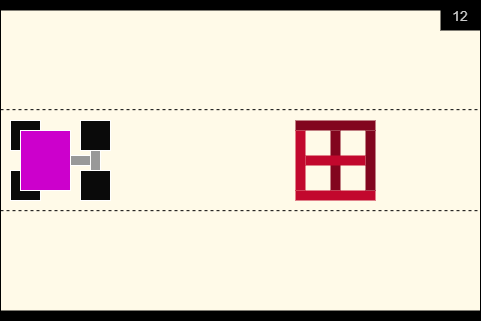

# Racer

#### Main Concept

Player is controlling a car and has to evade obstacles on its path.

#### Vision

There are *three* lines on a racing track, stacked vertically.  Player moves horizontally.

Player’s car is constantly moving to the left (implemented via making *everything* move to the right, except for the player’s car), and can change a line via moving either top or bottom.

Periodically, various obstacles appear. These obstacles have different speeds and sizes. Some obstacles (e.g.: other cars) also periodically change lines.

When a player crashes it loses health points. When all health points are depleted, the game ends.

The longer the game lasts, the higher the player’s car’s speed becomes, resulting in an increase in difficulty.

#### Player controls

Player can either move `up` or `down`, that results in a track line change.

#### Game scenario

> Bold entries indicate player's actions, while other indicate system's response

1. Program starts.

2. Menu screen is displayed with two options:

   `Start` `Select car` `Exit`

3. **Player selects** `Start`.

   1. Game starts. Currently selected player's car is displayed in the right part of the screen. Current score is displayed in the right top part of the screen.

   2. Periodically, obstacles begin to appear in the left part of the screen, moving to the right.

   3. **Player** `moves down` **or** `moves up` **to evade obstacles**.

   4. Player gains *1 score point* every second, until he crashes.

   5. Game's speed increases every second, making obstacles move faster towards the right part of the screen.

   6. Eventually, player crashes into an obstacle, and game ends.

   7. "Game over" screen is displayed, with player's score and two options:

      `Try again` `Change car` `Exit`

      1. **Player selects** `Try again`.
         1. New game starts (3.1).
      2. **Player selects** `Change car`.
         1. Car selection screen is displayed (4.1).
      3. **Player selects** `Exit`
         1. Application exits (5.1).

4. **Player selects** `Select car`

   1. Three possible cars appear on the screen.
   2. **Player selects one of three cars.**
   3. New game starts (3.1).

5. **Player selects** `Exit`

   1. Application exits.

      

#### Obstacles

We will limit ourselves to a total of 4 types of obstacles:

1. Static objects.

   These objects don't move, they will have low relative speed and always stay on the same track line.

   They have different shape: a single obstacle can block up to two lines.

2. Cars (3 types):

   Cars move towards the player.

   Cars can change their track line. They can change it only *once per 2 seconds*.

   There are three patterns of how the car can change its line:

   1. Always stays on the same line
   2. Switches between initial and adjusting line, thus never occupying the third line.
   3. Bounces between lines, e.g.: *bottom, middle, top, middle, bottom, middle, ...*

Obstacles and cars vary in shape, cars also have different speeds.

Obstacles will spawn randomly, when the previous obstacle is out of view. First obstacle spawn immediately at the game start.

#### Collisions

For the sake of simplicity, we will assume all objects (cars, static obstacles) have rectangle colliders. 

Player can crash into an obstacle when it is in front of them, and when moving up or down into an obstacle.

#### Different cars

There are three different cars, that differ in size. The bigger the car, the faster it is, but it's also easier to crash it into an obstacle. Cars have different *length*. 

#### Input

Input is received from the console, via `getch()`. `w` `a` `s` `d` `Enter` keys are supported, with alternative key bindings: `←` `→` `↓` `↑`.

#### Concept images

