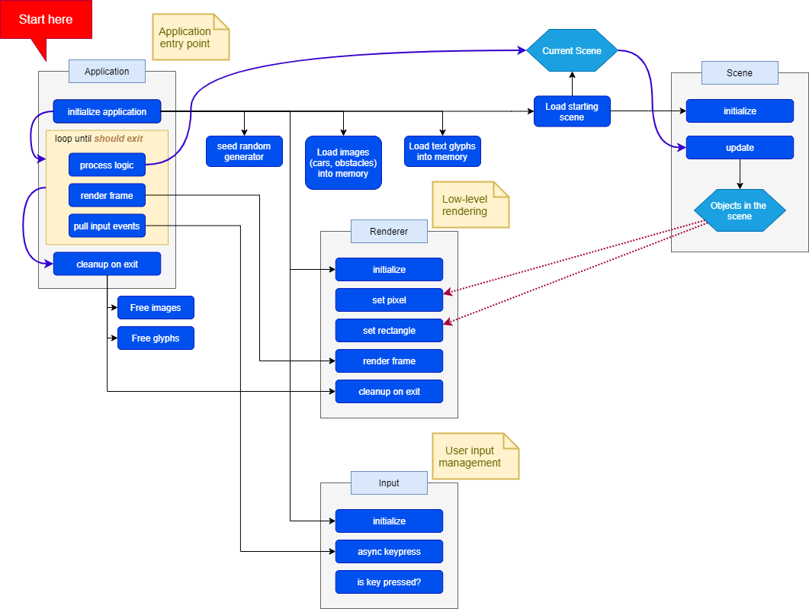

### Application architecture

At a high level, program architecture is as follows:

Starting at `main.cpp`, we perform application initialization, which does the following:

1. Seeds random generator.
1. Initializes renderer module.
1. Initializes input module.
1. Loads textures for images (cars and obstacles).
1. Loads text glyphs.
1. Loads starting scene.

Then the application main loop begins:

1. Process logic
1. Render frame
1. Pull input events

Process logic checks if `Esc` key was pressed (we want to exit application in that case, globally), and then calls `update()` on the currently loaded scene.

Currently loaded scene in its `update()` method does whatever it needs to do. This generally results in rendering something to the screen. Objects that need to render something talk to `renderer` and call its `renderer::clear_framebuffer()`, `renderer::set_pixel()` and `renderer::set_rect()` functions to send data to framebuffer.

After all of the scene logic has been processed, `renderer::render_frame()` is called to send current framebuffer data to the board and display it.

Lastly, `input` checks if user has pressed any button (via `update()`). This uses non-blocking keypress checking (local to Linux, for this project). Pressed key gets updated and the loop begins again (i.e., with processing global application logic), unless the `application::should_exit` flag has been set to `true`.